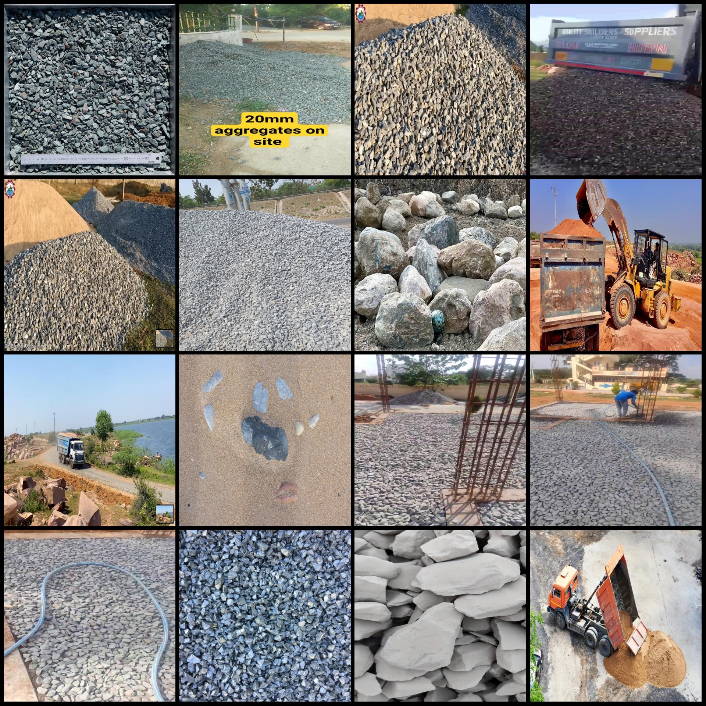
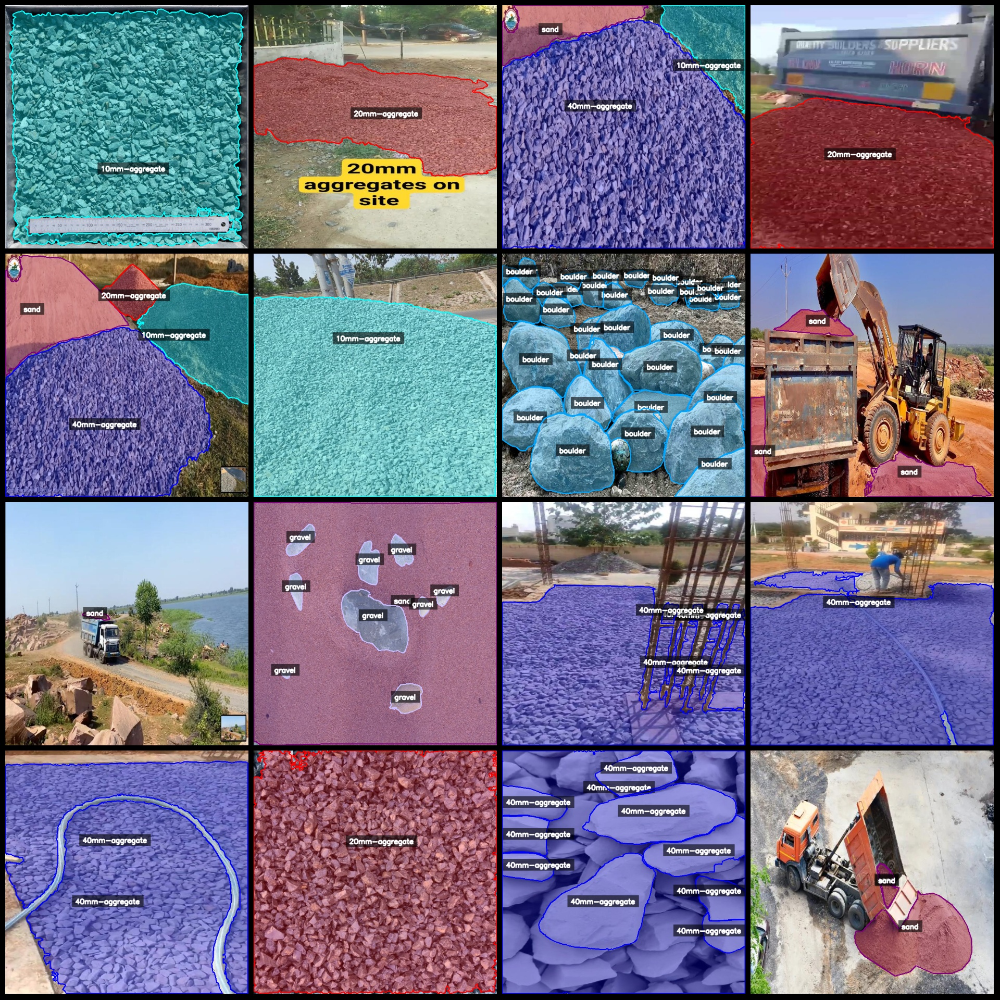
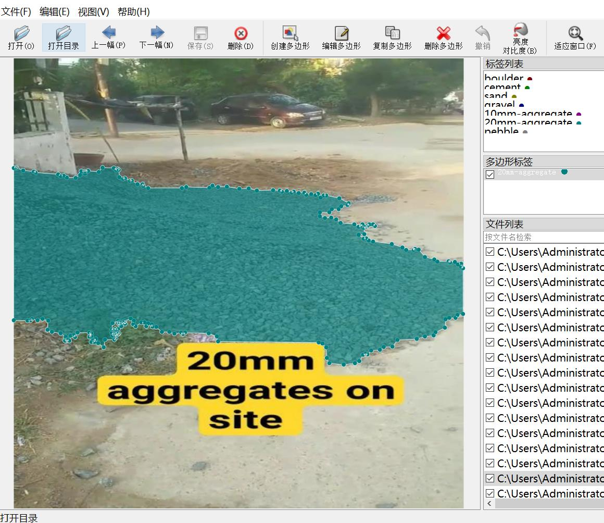

# Intelligent Industrial Sandstone Size and Volume Identification and Segmentation Dataset - labelme Format: 568 Images (8 Categories)

Dataset format: labelme format (without mask files, only containing JPG images and corresponding JSON files)
Number of images (JPG file count): 568
Number of annotations (JSON file count): 568
Number of annotation categories: 8
Annotation category names: ["10mm-aggregate", "20mm-aggregate", "40mm-aggregate", "boulder", "cement", "gravel", "pebble", "sand"]
Box count for each category:
10mm-aggregate (10mm aggregate) count = 2503
20mm-aggregate (20mm aggregate) count = 460
40mm-aggregate (40mm aggregate) count = 797
boulder (large boulder) count = 411
cement (cement) count = 43
gravel (gravel) count = 750
pebble (pebble) count = 2298
sand (sand) count = 291
Total box count: 7553

Annotation tool used: labelme=5.5.0
Image resolution: 640x640
Annotation rules: Polygon annotation for each category

Important Notice: The dataset can be edited using labelme, but the JSON dataset needs to be converted into mask or yolo format or coco format for semantic segmentation or instance segmentation.
Special Disclaimer: This dataset does not guarantee any accuracy in the trained models or weight files.

Image previews:
Annotation examples:
Original images (pick 16 randomly):
Annotation drawing results:

## Image

Here is a pay link on Stripe ( https://buy.stripe.com/3cs8yP7sY87d0vu9AB ). Please contact me lonlonago@foxmail.com after funding $89, and I will send you a complete data files , thank you!

